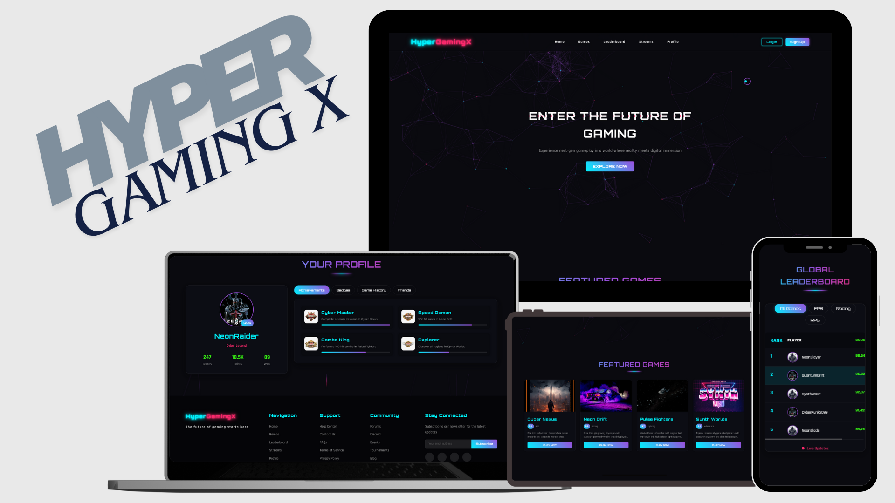

# ⚡ HyperGamingX – Next-Gen Gaming Platform

**HyperGamingX** is a futuristic, responsive, and immersive web platform for gamers.  
It provides an interactive experience where users can explore games, track achievements, and compete globally on leaderboards — all wrapped in a sleek cyber-themed interface.



---

## ✨ Features

- **Homepage:** Dynamic hero section introducing the future of gaming with a glowing call-to-action button.  
- **Featured Games:** Showcases trending and new releases with quick access buttons.  
- **Player Profile:** Displays user statistics, achievements, badges, and friends list in a clean dashboard.  
- **Global Leaderboard:** Real-time ranking system featuring top global players across multiple genres.  
- **Game Categories:** Filter by FPS, RPG, Racing, and other game types.  
- **Responsive Layout:** Fully optimized for desktops, tablets, and smartphones.  
- **Dark Neon Theme:** Modern cyber aesthetic with glowing gradients and futuristic typography.  
- **Smooth Animations:** Interactive hover effects, animated particle backgrounds, and seamless transitions.  
- **Community Integration:** Tournaments, friend connections, and social sharing features (optional).  

---

## 🛠️ Tech Stack

- **HTML5** – Structure and markup.  
- **CSS3 / Tailwind CSS** – Styling, responsive layouts, and neon effects.  
- **JavaScript (ES6)** – Dynamic UI components and animations.  
- **JSON / Local Storage** – Temporary data handling for profiles and scores.  

---

## ⚙️ Setup Instructions

### Clone the repository
```bash
git clone https://github.com/your-username/hypergamingx.git
